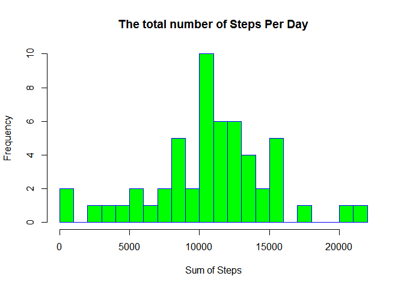
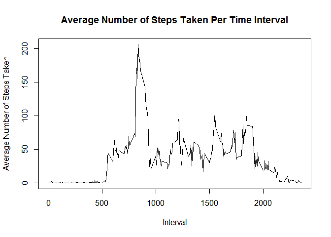
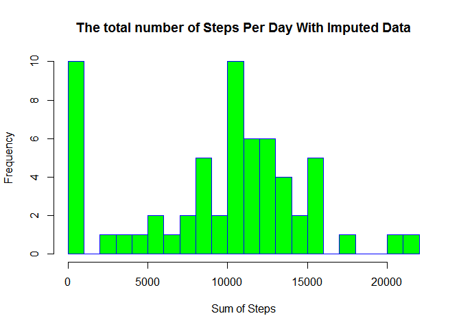
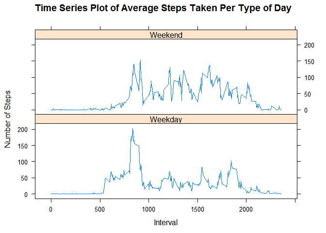

# Reproducible Research: Peer Assessment 1


## Loading and preprocessing the data

**1.Load the data**


```r
activitydata <- read.csv("activity.csv")
```

**2.Process the data**

2.1.Take out rows with NA

```r
actdatacompl <- activitydata[complete.cases(activitydata),]
```

2.2.Save Sum of steps per day to a new table

```r
sumstepsperday <- aggregate(actdatacompl$steps, by=list(date=actdatacompl$date), FUN=sum, na.rm=TRUE)
```

2.3.Save average steps per time interval to a new table

```r
avgstepsperinterval <- aggregate(actdatacompl$steps, by=list(date=actdatacompl$interval), FUN=mean, na.rm=TRUE)
```

2.4.Save mean steps per day to a new table

```r
meanstepsperday <- aggregate(activitydata$steps, by=list(date=activitydata$date), FUN=mean, na.rm=TRUE)
meanstepsperday <- replace(meanstepsperday, is.na(meanstepsperday), 0)
```

2.5.Get a subset of all rows with NA

```r
actdataNA<-activitydata[!complete.cases(activitydata),]
actdataNA$steps0<-0
```

## What is the mean total number of steps taken per day?

**1. Here is a histogram of the total number of steps taken each day.**


```r
hist(sumstepsperday$x, 
     main="The total number of Steps Per Day", 
     xlab="Sum of Steps", 
     border="blue", 
     col="green",
     breaks=20)
```

<!-- -->

**2. Calculate and report the mean and median total number of steps taken per day**

```r
mean1 <- mean(sumstepsperday$x, na.rm=TRUE)
mean1 <- format(round(mean1, 2), nsmall = 2)
median1 <- median(sumstepsperday$x, na.rm=TRUE)
median1 <- format(round(median1, 2), nsmall = 2)
```

> The mean total-number-of-steps-per-day is **10766.19**. 

> The median total-number-of-steps-per-day is **10765.00**.


## What is the average daily activity pattern?

**1.Here is a time series plot (i.e. type = "l") of the 5-minute interval (x-axis)**
**and the average number of steps taken, averaged across all days (y-axis)**


```r
plot(avgstepsperinterval$date, avgstepsperinterval$x, pch = 20, type="l", xlab="Interval", ylab = "Average Number of Steps Taken", main="Average Number of Steps Taken Per Time Interval")
```

<!-- -->

**2.Which 5-minute interval, on average across all the days in the dataset, contains the maximum number of steps?**


```r
max1<-avgstepsperinterval[which.max(avgstepsperinterval$x),]
max2<-max1[1,1]
```

> The Interval with value **835** has the Maximum number of Steps on average across all days in the dataset.


## Imputing missing values

**1.Calculate and report the total number of missing values in the dataset (i.e. the total number of rows with NAs)**


```r
countNA <- nrow(actdataNA)
```


> There are **2304** rows with NAs.


**2.Devise a strategy for filling in all of the missing values in the dataset. **
**The strategy does not need to be sophisticated. **
**For example, you could use the mean/median for that day, or the mean for that 5-minute interval, etc.**


Fill in the NAs with the mean per day

```r
fillNA<-merge(actdataNA,meanstepsperday,by.x="date",b.y="date")
```


**3.Create a new dataset that is equal to the original dataset but with the missing data filled in.**

New dataset with no NAs

```r
fillNA2<-fillNA[,c("steps0","date","interval")]
names(fillNA2)[names(fillNA2)=="steps0"] <- "steps"
activityfilled <-rbind(actdatacompl,fillNA2)
```


**4.Make a histogram of the total number of steps taken each day and **
**Calculate and report the mean and median total number of steps taken per day. **
**Do these values differ from the estimates from the first part of the assignment?**
**What is the impact of imputing missing data on the estimates of the total daily number of steps?**


```r
sumstepsperdayfilled <- aggregate(activityfilled$steps, by=list(date=activityfilled$date), FUN=sum, na.rm=TRUE)
```

Here is a histogram of the total number of steps taken each day with imputed data.

```r
hist(sumstepsperdayfilled$x, 
     main="The total number of Steps Per Day With Imputed Data", 
     xlab="Sum of Steps", 
     border="blue", 
     col="green",
     breaks=20)
```

<!-- -->


Calculate and report the mean and median total number of steps taken per day with imputed data


```r
mean2 <- mean(sumstepsperdayfilled$x, na.rm=TRUE)
mean2 <- format(round(mean2, 2), nsmall = 2)
median2 <- median(sumstepsperdayfilled$x, na.rm=TRUE)
median2 <- format(round(median2, 2), nsmall = 2)
```


> The mean total-number-of-steps-per-day *(with imputed data)* is **9354.23**. Originally **10766.19**.  

> The median total-number-of-steps-per-day *(with imputed data)* is **10395.00**. Originally **10765.00**. 


**Question: Do these values differ from the estimates from the first part of the assignment?**

> Answer: *Yes, the original and new values for mean and median are different.*


**Question: What is the impact of imputing missing data on the estimates of the total daily number of steps?**

> Answer: *The mean and median both decreased after imputing.  The NA replacement values must be bringing them down.*


## Are there differences in activity patterns between weekdays 


**1.Create a new factor variable in the dataset with two levels **
**- "weekday" and "weekend" indicating whether a given date is a weekday or weekend day.**

Add a factor variable to determine Day of week and flag if weekend or weekday


```r
activityfillday <- activityfilled
activityfillday$WeekDay <- format(as.Date(activityfillday$date),"%w")
activityfillday$WeekDayType <- ifelse(activityfillday$WeekDay %in% c(1,2,3,4,5),"Weekday", "Weekend")
```


**2.Make a panel plot containing a time series plot (i.e. type = "l") of the**
**5-minute interval (x-axis) and the average number of steps taken, averaged**
**across all weekday days or weekend days (y-axis).**


Get the average number of steps taken group by weekdays or weekends

New table for average steps per time interval grouped by weekday or weekend type


```r
activityweekday <- subset(activityfillday, WeekDayType == "Weekday", 
                          select = c("steps","interval","WeekDayType"))
avgstepsweekday <- aggregate(activityweekday$steps, by=list(date=activityweekday$interval), 
                             FUN=mean, na.rm=TRUE)
avgstepsweekday$DayType<-"Weekday"
names(avgstepsweekday)[names(avgstepsweekday)=="x"] <- "Average"

activityweekend <- subset(activityfillday, WeekDayType == "Weekend", 
                          select = c("steps","interval","WeekDayType"))
avgstepsweekend <- aggregate(activityweekend$steps, by=list(date=activityweekend$interval), 
                             FUN=mean, na.rm=TRUE)
avgstepsweekend$DayType<-"Weekend"
names(avgstepsweekend)[names(avgstepsweekend)=="x"] <- "Average"

avgsteps<-rbind(avgstepsweekday,avgstepsweekend)
```

Here is a time series plot (i.e. type = "l") of the 5-minute interval (x-axis) and the average number of steps taken, averaged across all weekday days or weekend days (y-axis).


```r
library(lattice)
xyplot(Average ~ date | DayType, data=avgsteps, type = "l", 
       main="Time Series Plot of Average Steps Taken Per Type of Day", 
       ylab="Number of Steps", xlab="Interval", layout = c(1,2))
```

<!-- -->


**Question: Are there differences in activity patterns between Weekdays and Weekends?**

> *Answer:  Yes, there is a difference in activities.  The Number of Steps indicate that the respondents are, on average, more active on Weekends and less active on Weekdays.*


